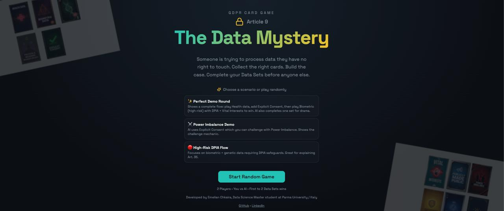
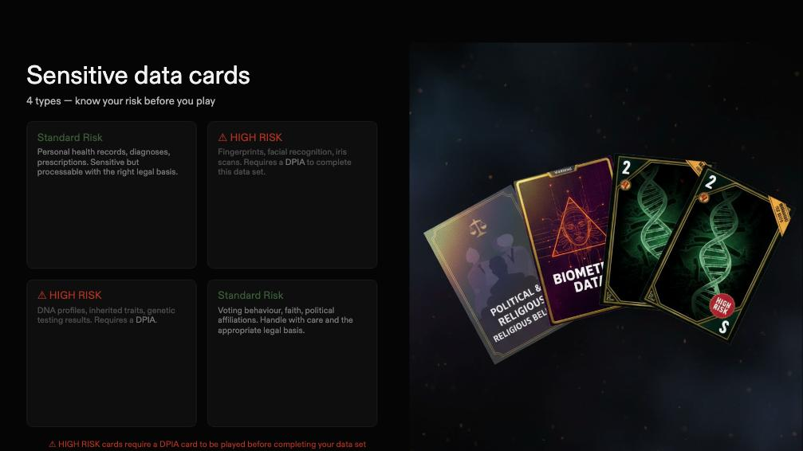
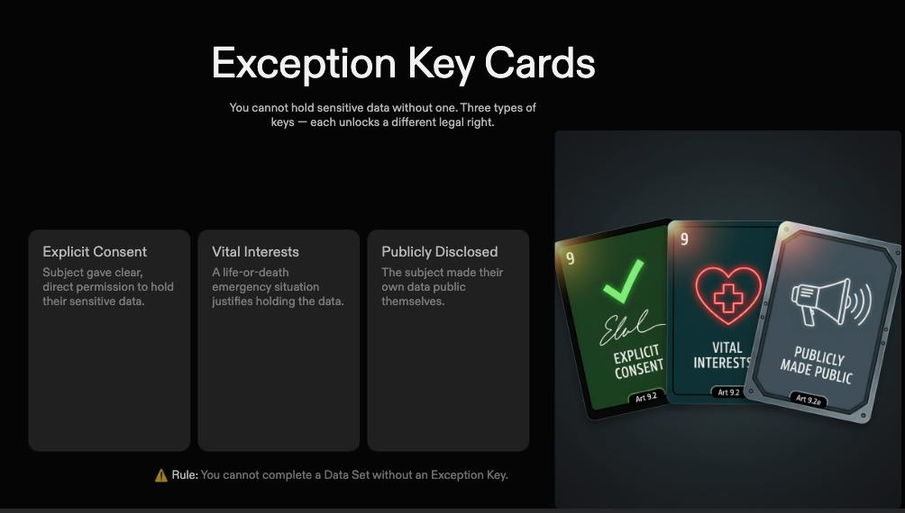
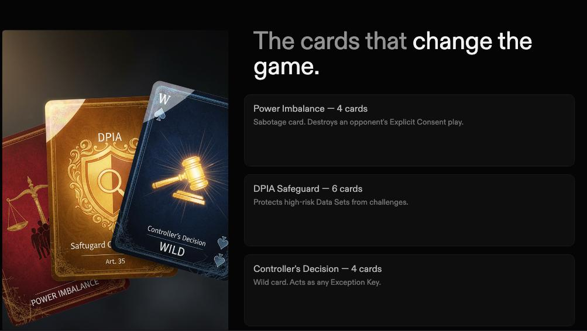
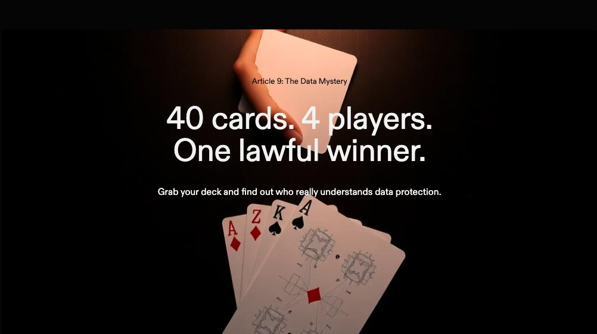

# THE DATA MYSTERY

GDPR Article 9 says sensitive personal data cannot be processed unless a valid legal exception applies; in this game, you will build lawful Data Sets by matching Sensitive Data cards with the right Exception Keys and adding DPIA for high-risk cases.

## 🚀 Live
- **Play now:** https://candid-valkyrie-10dcc5.netlify.app

## 🎯 What It Is
- A 1v1 card game: **You vs AI**
- Goal: complete **2 lawful Data Sets** to win
- Core idea: GDPR Article 9 in a practical, interactive format

## 🧠 How It Works
- Play a **Sensitive Data** card to start a set
- Attach a valid **Exception Key**
- If data is high-risk (Biometric/Genetic), add **DPIA**
- Invalid legal combinations are blocked

## ⚖️ Rule Highlights
- `Political/Religious + Vital Interests` -> blocked
- `Biometric/Genetic + Publicly Disclosed` -> blocked
- `Controller's Decision` -> wildcard Exception Key
- `Power Imbalance` -> challenges Explicit Consent-based sets

## 🃏 Card Types
- **Sensitive Data:** Health, Biometric, Genetic, Political/Religious
- **Exception Keys:** Explicit Consent, Vital Interests, Publicly Disclosed
- **Safeguard:** DPIA
- **Action Cards:** Power Imbalance, Controller's Decision

## 🖼️ Media
- Screenshots:






- PDF: [Welcome Players](public/welcome-players.pdf)

## 🛠️ Tech Stack
- React + TypeScript
- Vite
- Tailwind CSS
- shadcn/ui
- Vitest

## 💻 Run Locally
```bash
npm install
npm run dev
```

## 📦 Build
```bash
npm run build
npm run preview
```

## ✅ Test
```bash
npm run test
```

## 👤 Author
**Emelian Chkaira**  
Data Science Master student, Parma University (Italy)

- GitHub: https://github.com/emelian-chkaira
- LinkedIn: https://linkedin.com/in/emelianchkaira
